# Contact Center Map

A [Power Platform ToolBox](https://www.powerplatformtoolbox.com/) tool that draws the configuration of **Dynamics 365 Contact Center** (Omnichannel and unified routing) so you can understand and document it at a glance.

Pick a workstream, queue, rule or user and the tool draws everything that flows into and out of it:

**channel → workstream → routing rulesets → rules → queues**, with each queue showing its **operating hours**, **PreQueue and InQueue overflow** and **agents** inside its own card.

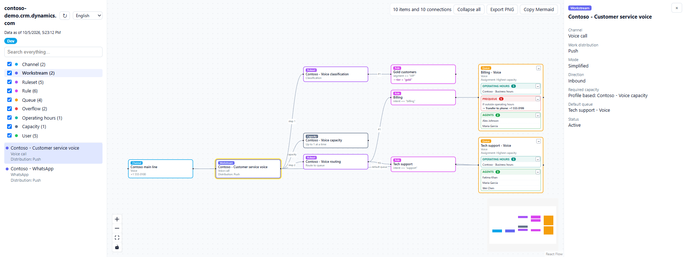

<sub>All screenshots use demo data.</sub>

## Features

- Channels (voice with phone number, WhatsApp, chat, Teams, Facebook, SMS, custom messaging), bots and capacity profiles linked to each workstream.
- Routing rules shown as readable conditions (for example `If outside operating hours → Transfer to phone: +1 555 0100`), with the target queue resolved by name. Rules that split work by percentage draw an arrow to each queue with its share (`80%`), a rule with its own overflow (*Handle rule-specific overflows*) links to that overflow ruleset, records referenced by GUID (a workstream, a queue) show their name, and wait times keep their unit (`If queue_inqueue.lapsedwaittime >= 30 s`).
- Overflow actions resolved to their target queue or phone number. "Transfer to queue" overflows are also drawn as an arrow.
- Every section inside a queue card (operating hours, PreQueue, InQueue, agents) can be minimized with its **−/+** button, or all at once from the toolbar.
- One click on a card highlights its incoming path and everything below it; click the background to clear.
- The detail panel on the right is always visible. It can be resized by dragging its left edge (or with the arrow keys on it), and its width is remembered; **›** minimizes it until you pick another item.
- **Export PNG** for documents and **Copy Mermaid** for wikis or Markdown.
- Optional **Edit mode** (off by default): add or remove agents, create queues, create workstreams from an existing one, edit the details of workstreams, queues and capacity profiles (including unit-based or profile-based capacity and new capacity profiles), edit how a workstream identifies the customer, and add or delete rules in route-to-queue and classification rulesets, with preview, confirmation and undo. See [What this tool changes](#what-this-tool-changes).
- Follows the ToolBox light and dark theme.
- Available in English, Spanish, Portuguese, French, German and Italian. The language follows your system and can be changed in the sidebar. Values coming from Dataverse (option sets, lookups) use the language of the connected user.

| Each queue in its own card | One click highlights the path |
|---|---|
| 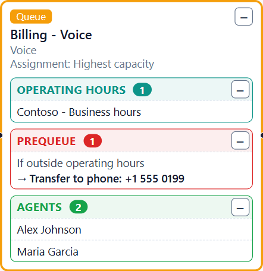 | 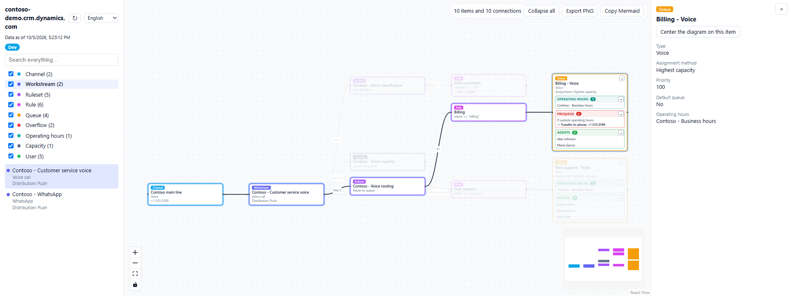 |

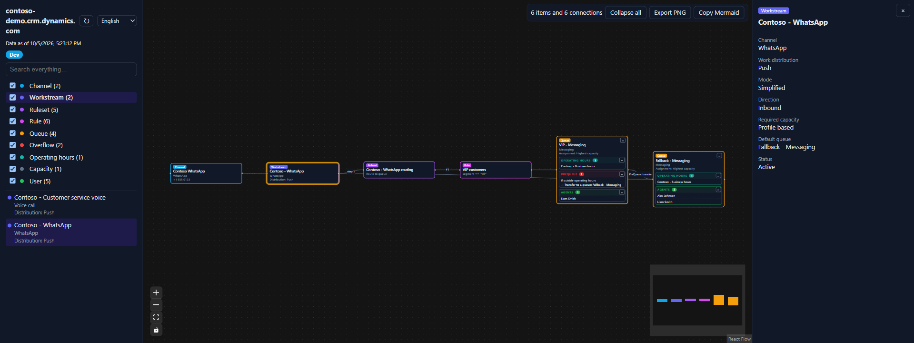

## Usage

1. Connect to an environment in Power Platform ToolBox (interactive login or client ID and secret; the connection is managed by ToolBox).
2. Open **Contact Center Map**. It reads the configuration of the active connection and reloads automatically when you switch connection. Use **↻** (next to the language) to re-read it after changing something in the admin center; the selected item and the map position are kept.
3. Choose an item from the list on the left.

## Edit mode

Turn on **Edit mode** in the sidebar (only inside ToolBox). A banner shows the org and environment that changes go to, and a **Create** panel appears. You can then:

- add or remove agents in a queue card (**+ Add agent**, **×**);
- create a queue, or a workstream copied from an existing one of the same channel (**Create → Queue / Workstream**);
- add or delete rules in route-to-queue and classification rulesets (**+ Add rule**, **×** on a rule);
- edit the details of a workstream, queue or capacity profile from the detail panel (**✎ Edit**). For a workstream, this includes switching between unit-based and profile-based capacity, linking or unlinking capacity profiles, and creating a new profile;
- edit how a workstream identifies the customer (**✎ Customer identification** in the detail panel). The **Visual** tab shows, for each table (account, contact, case), one row per condition: which columns must match a conversation value (a pre-conversation answer such as Name or Email, the customer's phone number, or a context variable) or a fixed value (such as Status Reason = 1), and which table is preferred when several match. The **FetchXML** tab shows the whole column formatted for developers, and any table can be edited there. The admin center has no screen for these rules; the detail panel also shows them read-only.

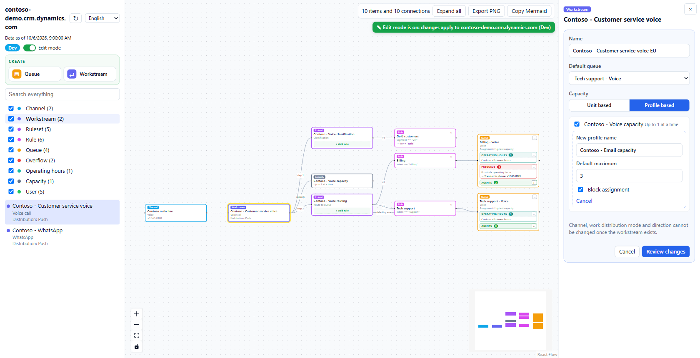

| Customer identification (visual) | The same rules as FetchXML |
|---|---|
| 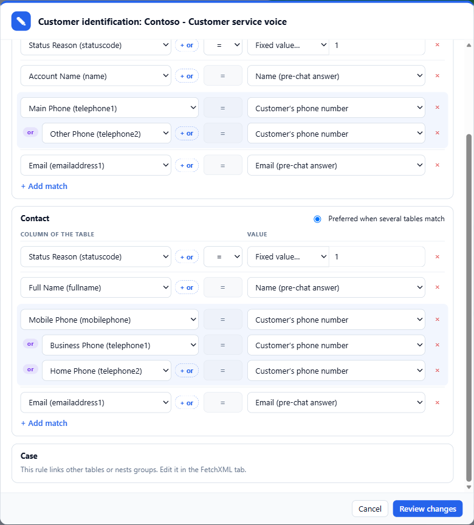 | 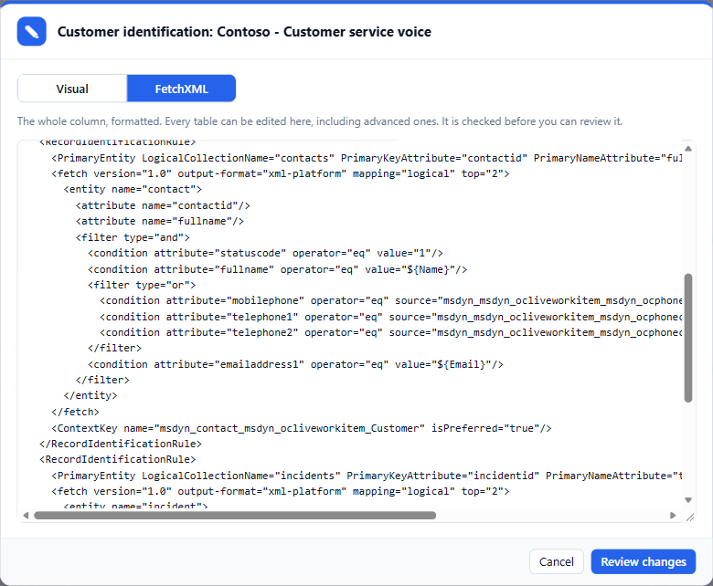 |

Nothing is written until you confirm. Every change shows a preview with the org and environment, adds a warning for Production, and can be undone from the message shown right after it.

| Preview before saving | Undo right after |
|---|---|
| 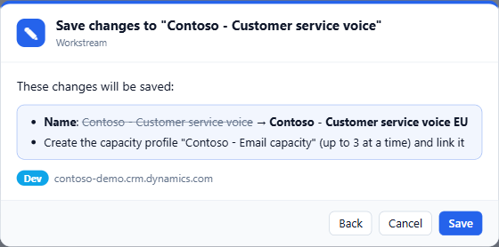 | 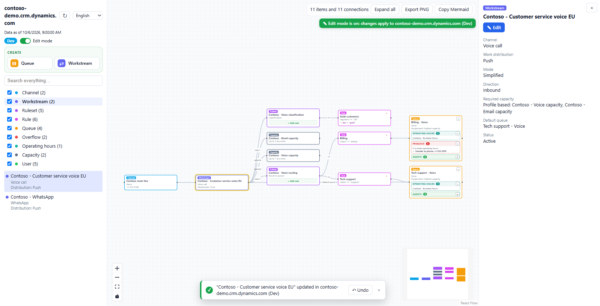 |

| Add a rule | Create a workstream |
|---|---|
| 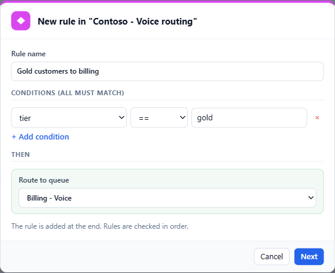 | 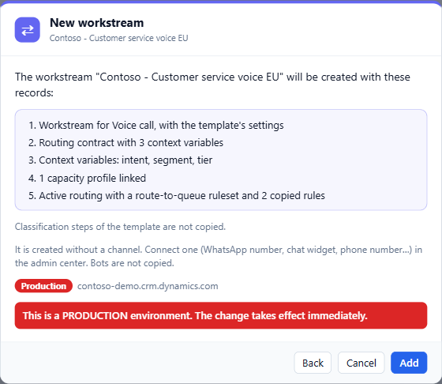 |

See [What this tool changes](#what-this-tool-changes) for exactly which records each action writes and how it is undone.

## Permissions

The map only needs read access. The connected user (or application user) must be able to read the Omnichannel configuration tables, such as `msdyn_liveworkstream`, `msdyn_routingconfiguration`, `msdyn_decisionruleset`, `msdyn_decisioncontract`, `msdyn_ocliveworkstreamcontextvariable`, `msdyn_assignmentconfiguration`, `queue`, `queuemembership`, `systemuser`, `msdyn_operatinghour`, `msdyn_overflowactionconfig` and the channel tables. Edit mode needs the extra privileges listed in [What this tool changes](#what-this-tool-changes).

If a table cannot be read, the map is still drawn and the sidebar lists which tables failed and why.

## What this tool changes

By default, nothing: the map is read-only and only runs `GET` queries against the Dataverse Web API.

With **Edit mode** switched on (a switch in the sidebar, off by default and only available inside ToolBox), the tool can make exactly these changes:

| Change | Dataverse operation | Undo |
|---|---|---|
| Add a user to a queue | Associate `queue` ↔ `systemuser` (`queuemembership_association`), the same as *Add users* in the Contact Center admin center | Removes the user again |
| Remove a user from a queue | Disassociate the same relationship | Adds the user again |
| Create an omnichannel queue | Create `queue` (name, type, assignment method, priority, operating hours). Type and assignment method only offer values already used by existing omnichannel queues | Deletes the new queue |
| Create a workstream from an existing one (same channel) | Create, in this order: a routing contract (`msdyn_decisioncontract`) with the template's context variables, the workstream (`msdyn_liveworkstream`) with the template's settings, default queue, session and notification templates, its context variables, its capacity profile links and, when the template has a route-to-queue step, an active routing configuration with one queue-identification step and a route-to-queue ruleset (empty, or with the template's rules copied). The channel, bots and API keys are not copied; classification steps are not copied. If any record fails, the ones already created are deleted before the error is shown | Deletes every created record, newest first |
| Add a rule to a **route-to-queue** or **classification** ruleset | Update `msdyn_decisionruleset.msdyn_rulesetdefinition`: the new `<rule>` is appended at the end; the rest of the definition is left untouched | Writes the previous definition back |
| Delete a rule from those rulesets | Same update, removing that one `<rule>` | Writes the previous definition back |
| Edit a workstream (**✎ Edit** in the detail panel) | Update `msdyn_liveworkstream`: name, default queue, capacity format (unit based or profile based) and units required. Channel, work distribution mode and direction are never changed (the admin center does not allow it either) | Writes the previous values back |
| Link or unlink capacity profiles of a profile-based workstream | Create or delete `msdyn_liveworkstreamcapacityprofile` | Deletes the new link / creates the removed link again |
| Create a capacity profile from a workstream | Create `msdyn_capacityprofile` (name, default maximum, block assignment, reset immediately, unique name `new_<id>` like the admin center) and link it to the workstream | Deletes the link and the profile |
| Edit a queue | Update `queue`: name, priority and operating hours | Writes the previous values back |
| Edit the customer identification of a workstream | Update `msdyn_liveworkstream.msdyn_recordidentificationrule`. From the **Visual** tab, only the top-level filter of each edited table (its conditions) and the `isPreferred` flags are rewritten; every other part of the XML is left as it was (line endings are normalized to LF). Tables whose rule links other tables, nests groups or contains comments can't be edited in the Visual tab. From the **FetchXML** tab any table can be edited, and the column is saved as shown there (formatted). Either way the XML is checked before it can be reviewed: well formed, a rule set whose rules have `PrimaryEntity`, `fetch`/`entity`, `ContextKey` and at least one condition, every condition with a column, and at most one preferred table | Writes the previous XML back |
| Edit a capacity profile | Update `msdyn_capacityprofile`: name, default maximum and block assignment. The preview says how many workstreams use the profile | Writes the previous values back |

Overflow, assignment and system rulesets are never edited. Rule conditions can only use the variables of the ruleset's input contract (or attributes its rules already use) and operators already used in the environment. Before writing a ruleset or the edited fields of a record, the tool reads them again and refuses to write if they changed since the map was loaded (for example in the admin center); undo checks the same before writing the previous values back. Capacity profile links are not re-checked: linking a profile someone else already linked adds a second link, and unlinking one that is already gone fails and reverts the save. Refreshing the map closes an open edit form. When saving details changes several records and one fails, the ones already changed are reverted before the error is shown.

Every change:

- starts only from an explicit click (**+ Add agent**, **×**, **Create → Queue** or **Create → Workstream**, **+ Add rule**, **✎ Edit** then **Review changes**);
- shows a preview naming what changes (for details, every field with its old and new value), the org and the environment type, with an extra warning for **Production** connections, and waits for confirmation;
- can be reverted with **Undo** in the message shown right after it;
- runs with the permissions of the ToolBox connection. It needs Append and Append To on *Queue* and *User* (agents), Create and Delete on *Queue* (queues), Write on *Decision rule set* (rules), and Create and Delete on *Workstream*, *Decision contract*, *Decision rule set*, *Routing configuration*, *Routing configuration step*, *Context variable* and *Workstream capacity profile* (workstreams), Write on *Workstream*, *Queue* and *Capacity profile*, Create and Delete on *Capacity profile* and *Workstream capacity profile*, and Append and Append To on *Workstream*, *Queue*, *Operating hours*, *Capacity profile* and *Workstream capacity profile* (details); the Omnichannel administrator role, for example, covers them. If any is missing, the Dataverse error is shown and nothing changes.

No other records are created, updated or deleted. Creating new context variables is not supported yet.

## Privacy

Credentials never reach the tool: all requests go through the ToolBox `dataverseAPI`. Nothing is sent anywhere else. Exported PNG and Mermaid files contain agent names and emails, so share them accordingly.

## Limitations

- Classification rules are shown as rules with their actions. Skills and capacity per agent are not drawn yet.
- Only the active routing configuration of each workstream and the active assignment configuration of each queue are shown.

## Development

```
npm install
npm run build   # dist/ for ToolBox
npm test        # parser, graph, i18n, ToolBox adapter and edit checks
```

To try it locally in the desktop app: **Settings → Show Debug Menu**, then **Debug → Load Local Tool** and select this folder.

## AI-assisted development

Parts of this tool were generated with Claude Code (Anthropic) and reviewed, tested, and maintained by the contributors listed in package.json.

## License

MIT. The bundle includes third-party code under its own licenses:

- [React](https://github.com/facebook/react) and [React Flow](https://github.com/xyflow/xyflow): MIT
- [html-to-image](https://github.com/bubkoo/html-to-image): MIT
- [elkjs](https://github.com/kieler/elkjs) (Eclipse Layout Kernel): EPL-2.0. Source code is available at the linked repository.
